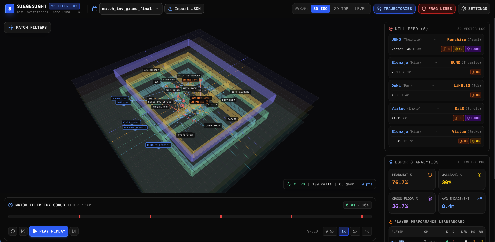

# SiegeSight — 3D Esports Telemetry & Replay Visualizer

**[Live Demo: siege-sight.vercel.app](https://siege-sight.vercel.app/)**

[](https://react.dev)
[](https://www.typescriptlang.org/)
[](https://threejs.org/)
[](https://r3f.docs.pmnd.rs/)
[](https://tailwindcss.com/)
[](https://vitejs.dev/)

> **SiegeSight** is an esports-grade 3D telemetry visualization and spatial analytics application engineered for tactical FPS replay analysis (inspired by Rainbow Six Siege). It renders player positioning trajectories, multi-floor level layouts, 3D firefight engagement ray vectors, real-time tick-by-tick player interpolation, and automated match analytics.

---

## 📸 Interface Preview



*Figure 1: SiegeSight rendering 3D player position point clouds, engagement lines, floor level stacking, timeline playback scrubber, tactical kill feed, and real-time esports analytics dashboard.*

---

## ✨ Key Features

### 🎮 1. GPU-Accelerated 3D WebGL Scene
* **Attribute Shader Acceleration**: Packs tens of thousands of tick-by-tick spatial positions into raw `Float32Array` buffers. Floor level masks and player selections are filtered directly on the GPU in custom GLSL vertex shaders for high frame-rate performance.
* **3D Movement Trajectories**: Toggleable movement paths rendering historical player motion through map geometry.
* **Interactive 3D Engagement Vectors**: Visualizes firefights with colored 3D rays connecting killers and victims at the exact tick of elimination, highlighted with surface penetration, headshot, and cross-floor badges.

### 🏢 2. Multi-Floor Tactical Stack
* **Floor Level Filtering**: Isolate specific building levels (Basement, Ground Floor, 1st Floor, Roof) or stack them with transparent floor boundaries.
* **Preset Camera Perspectives**: Switch seamlessly between **3D Isometric**, **2D Top-Down Blueprint**, and **Level Angle** modes.

### ⏱️ 3. Deterministic Playback Engine
* **Tick-Precision Scrubbing**: Smooth 60 FPS timeline scrub slider with visual keyframe markers for kill events.
* **Transient State Bridge**: Playback scrubbing updates scene elements directly through Zustand transient subscriptions without triggering blocking React component re-renders.
* **Speed Multipliers**: Replay playback control from `0.5x` slow-motion to `4x` fast-forward with loop controls.

### 🎯 4. "Jump to Replay Moment" Engagement Context
* **Instant Replay Sync**: Selecting any frag event in the **Kill Feed** or **3D Line Field** opens an engagement modal. Clicking **"Jump to Replay Moment"** automatically:
  1. Sets the match round to the exact frag round.
  2. Isolates player filter to only the killer and victim.
  3. Sets visible floor levels to match both combatants.
  4. Syncs the playback cursor tick directly to the moment of elimination.

### 📊 5. Esports Analytics & Performance Leaderboard
* **Match Performance Metrics**: Calculates real-time Headshot %, Wallbang %, Cross-Floor Kill %, and Average Engagement Distance.
* **Player Leaderboards**: Dynamic breakdown of Kills, Deaths, K/D ratio, Headshots, and Soft Breach / Wallbang kills per player and operator.

### 📁 6. Custom Telemetry JSON Importer
* **Schema Validation**: Import custom match data via drag-and-drop JSON upload powered by `zod` schema validation.

---

## 🛠️ Technology Stack

| Layer | Technology | Purpose |
| :--- | :--- | :--- |
| **Framework** | React 19 + TypeScript 5.8 | Modern functional component UI with strict nominal typing |
| **3D Engine** | Three.js + React Three Fiber | WebGL rendering pipeline, custom shaders, camera controls |
| **3D Helpers** | `@react-three/drei` | Canvas environment, camera rig, orbit controls |
| **State Management** | Zustand 5 | Transient, non-blocking state subscriptions for 60 FPS scrubbing |
| **Styling** | Tailwind CSS v4 | High-density tactical dark design system |
| **Icons & Motion** | `lucide-react` + `motion` | UI icons and smooth drawer transitions |
| **Data Schema** | `zod` | Runtime JSON telemetry validation |
| **Build Tool** | Vite 6 | Rapid HMR dev server and optimized production bundler |

---

## 📁 Directory Structure

```
├── README.md                        # Documentation & overview
├── TUTORIAL.md                      # Step-by-step architectural tutorial guide
├── TELEMETRY_SCHEMA.md              # Zod JSON schema specification
│
├── src/
│   ├── App.tsx                      # Root application layout
│   ├── main.tsx                     # React DOM root entry
│   ├── index.css                    # Global CSS & Tailwind imports
│   │
│   ├── types/                       # TypeScript definitions
│   │   ├── brand.ts                 # Nominal types (MatchId, RoundId, PlayerId)
│   │   ├── telemetry.ts             # Raw telemetry data interfaces
│   │   ├── payload.ts               # Packed Float32Array binary data structures
│   │   └── spatial.ts               # Vector3 and floor coordinate types
│   │
│   ├── stores/                      # Zustand state management
│   │   ├── telemetry-store.ts       # Match manifests & custom JSON imports
│   │   ├── playback-store.ts        # Timeline tick, speed, and replay state
│   │   ├── filter-store.ts          # Round, team, player, and floor filters
│   │   └── selection-store.ts       # Selected engagement frag modal state
│   │
│   ├── lib/                         # Spatial maps & telemetry processing
│   │   ├── maps/                    # Map definitions (Bank map layout & rooms)
│   │   └── telemetry/               # Generators, Zod schemas, data packers
│   │
│   └── components/                  # React & R3F Components
│       ├── canvas/                  # 3D Scene, player point cloud, frag lines
│       └── dashboard/               # 2D HUD overlay, scrubber, filters, kill feed
```

---

## 🚀 Getting Started

### Prerequisites
* **Node.js**: `v18.0.0` or higher
* **npm** or **bun** / **yarn**

### Installation & Local Setup

1. **Clone the repository**:
   ```bash
   git clone https://github.com/your-org/siegesight.git
   cd siegesight
   ```

2. **Install dependencies**:
   ```bash
   npm install
   ```

3. **Start the local development server**:
   ```bash
   npm run dev
   ```
   Open [http://localhost:3000](http://localhost:3000) in your browser.

4. **Validate TypeScript & Build**:
   ```bash
   # Typecheck
   npm run lint

   # Production build
   npm run build
   ```

---

## 📄 Telemetry JSON Schema Example

Custom match telemetry files imported into SiegeSight follow this structural format:

```json
{
  "matchId": "m_inv_2026_grand_final",
  "matchName": "Six Invitational Grand Final",
  "mapId": "map_bank",
  "teams": [
    {
      "slot": "BLUE",
      "name": "Squad Alpha",
      "roster": [
        { "playerId": "p_alemao", "nickname": "Alemao", "operator": "Ash", "role": "ENTRY" }
      ]
    }
  ],
  "events": [
    {
      "roundId": "r_1",
      "tick": 120,
      "playerId": "p_alemao",
      "x": -4.2,
      "y": 1.5,
      "z": 8.1,
      "floorIndex": 1,
      "health": 100,
      "isAlive": true,
      "viewAngleY": 45.0
    }
  ],
  "frags": []
}
```

---

## 📖 Step-by-Step Building Guide

For an in-depth breakdown of how to build this exact application phase-by-phase (including GPU shader compilation, Zustand transient bridges, and spatial packing algorithms), see the included **[TUTORIAL.md](./TUTORIAL.md)**.

---

## 📜 License

This project is open source under the [MIT License](LICENSE).
